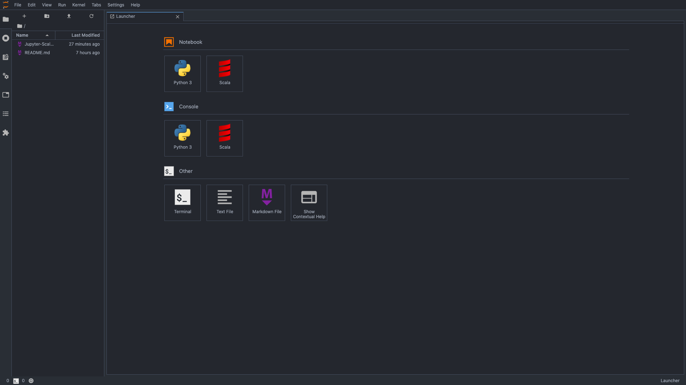

# Jupyter-Scala

**How to use scala in Jupyter notebook (Lab)**

1\. Install Scala Kernel (Mac OS):
```
$ brew install scala
$ brew install sbt
```
2\. Set the desired version of Scala and Almond as environment variables:  
(Writing your scala version)
```
$ SCALA_VERSION=2.12.10 ALMOND_VERSION=0.9.1
```
3\. Create a launcher via coursier:
```
$ curl -Lo coursier https://git.io/coursier-cli
$ chmod +x coursier
$ ./coursier bootstrap \
    -r jitpack \
    -i user -I user:sh.almond:scala-kernel-api_$SCALA_VERSION:$ALMOND_VERSION \
    sh.almond:scala-kernel_$SCALA_VERSION:$ALMOND_VERSION \
    -o almond
```
4\. Run the launcher to install the almond kernel:
```
$ ./almond --install
```
5\. Check the jupyter kernel:
```
$ jupyter kernelspec list

>>>
Available kernels:
  scala      /Users/byeon/Library/Jupyter/kernels/scala
  python3    /usr/local/share/jupyter/kernels/python3
```

6\. Check the kernel in Jupyter notebook (Lab):



7\. Choose the Scala !

<br />

### Reference
https://almond.sh/docs/quick-start-install